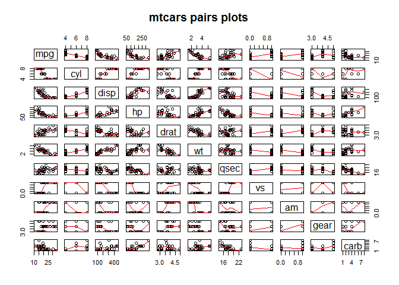
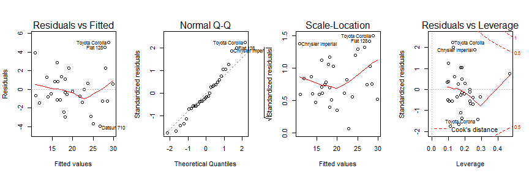

# The of effects on miles per gallon by transmission type.
Saturday, June 20, 2015  

##Executive summary
This report investigates the effect that the type of transmission has on the miles per gallon of the cars from the 'mtcars' dataset. This data was extracted from Motor Trend magazine in 1974 and looks at fuel economy  as a function of 10 variables for 32 vehicles in the 73-74 model years.  I will use a regression model to investigate the effects of these different variables on mpg. I will consider two different models: One where fuel economy is ONLY a function of transmission, and one where fuel consumption is a variable of the complete data set. 


###Exploratory Analysis  
I will start by loading the data into memory from the file and get an idea of what is in the data set. I am also going do a pairs plot to have a look at the individual variables


```r
data(mtcars)
pairs(mtcars, panel=panel.smooth, main="mtcars pairs plots")
```

 

We can see that there are seveal variables of considerable importance including the number of cylinder, the displacement, the horsepower, the weight, the transmission type, and the number of forward gears. Next I will convert some of the variables to factors, and fit a linear model with ONLY the transmission variable. These are variables that have discrete levels, rather than continuous

###Simplistic model fit 

```r
mtcars$am   <- factor(mtcars$am);mtcars$carb <- factor(mtcars$carb);mtcars$vs   <- factor(mtcars$vs)
mtcars$cyl  <- factor(mtcars$cyl);mtcars$gear <- factor(mtcars$gear)
simplemodel <- lm(mpg~am,data=mtcars)
summary(simplemodel)
```

```
## 
## Call:
## lm(formula = mpg ~ am, data = mtcars)
## 
## Residuals:
##     Min      1Q  Median      3Q     Max 
## -9.3923 -3.0923 -0.2974  3.2439  9.5077 
## 
## Coefficients:
##             Estimate Std. Error t value Pr(>|t|)    
## (Intercept)   17.147      1.125  15.247 1.13e-15 ***
## am1            7.245      1.764   4.106 0.000285 ***
## ---
## Signif. codes:  0 '***' 0.001 '**' 0.01 '*' 0.05 '.' 0.1 ' ' 1
## 
## Residual standard error: 4.902 on 30 degrees of freedom
## Multiple R-squared:  0.3598,	Adjusted R-squared:  0.3385 
## F-statistic: 16.86 on 1 and 30 DF,  p-value: 0.000285
```
From this fit we have seen that the average car with an automatic transmission has 17.1 mpg, with an an uncertainly 1.125, and the manual transition has an average of 24.3 mpg (7.2 more than the automatic) with an uncertainly of 1.76. The model has an R-squared coefficient (adjusted) of 0.34, indicating the model explains 34% of the variance in the data.  

###Refined model fit
I will now move on to creating a model which takes into account all the variables, and the do a refinement with the *step()* function.


```r
model2 <- lm(mpg~.,data=mtcars)
model2step <- step(model2, direction = 'both', trace=FALSE)
summary(model2step)
```

```
## 
## Call:
## lm(formula = mpg ~ cyl + hp + wt + am, data = mtcars)
## 
## Residuals:
##     Min      1Q  Median      3Q     Max 
## -3.9387 -1.2560 -0.4013  1.1253  5.0513 
## 
## Coefficients:
##             Estimate Std. Error t value Pr(>|t|)    
## (Intercept) 33.70832    2.60489  12.940 7.73e-13 ***
## cyl6        -3.03134    1.40728  -2.154  0.04068 *  
## cyl8        -2.16368    2.28425  -0.947  0.35225    
## hp          -0.03211    0.01369  -2.345  0.02693 *  
## wt          -2.49683    0.88559  -2.819  0.00908 ** 
## am1          1.80921    1.39630   1.296  0.20646    
## ---
## Signif. codes:  0 '***' 0.001 '**' 0.01 '*' 0.05 '.' 0.1 ' ' 1
## 
## Residual standard error: 2.41 on 26 degrees of freedom
## Multiple R-squared:  0.8659,	Adjusted R-squared:  0.8401 
## F-statistic: 33.57 on 5 and 26 DF,  p-value: 1.506e-10
```
We can see now that the effect of am on the best fit model. Having a manual transmission increases mpg by only 1.8 mpg with an uncertainly of 1.29 mpg. The R sqaured coefficient is 0.87 indicating an 87% explanation of the variation. The massive decrease from the simple model is most likely due to car weight as seen in the above chart. We also see that having a 6 cylinder, and an 8 cylinder (compared to a 4 cylinder) engine both decrease mpg, as does horsepower and weight. These all decrease (except for hp) the mpg, more than having a manual transmission increases it.

###Residual plots
Lastly I perform a diagnostic check of the residuals to see if there is anything of interest.


```r
par(mfrow=c(1, 4))
plot(model2step)
```

 
The residual plots indicate that there is no deviation in the residuals, thus I expect this is a reasonable step

###Conclusions
To answer the two question posed in this work:  
+A manual transmission **is better** than an automatic  
+The manual transmission gets approximalte 1.8 mpg better than an automatic, however, the uncertainly is very high at 1.29 mpg. This is just on the boarder of statistical significance. 
+If you want better gas mileage, having a 4 cylinder car, which has a lower weight is more important than having a manual transmission. 
